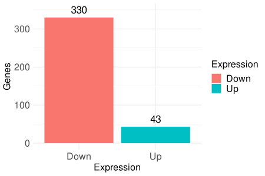
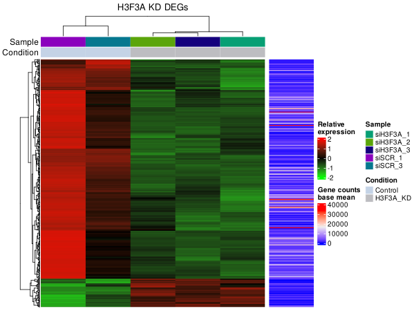
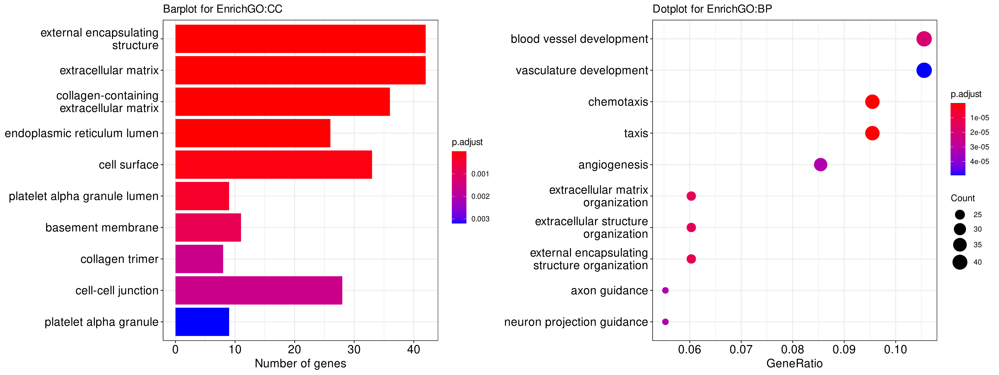
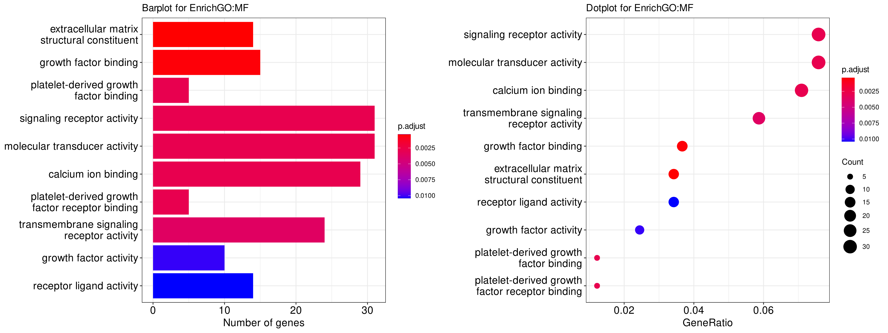
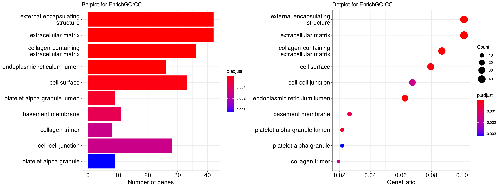
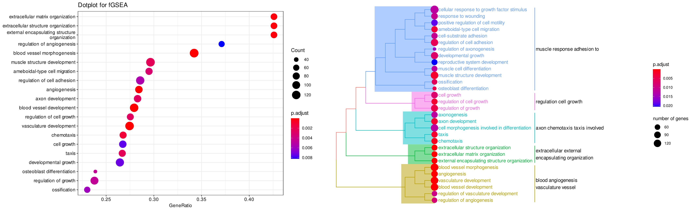
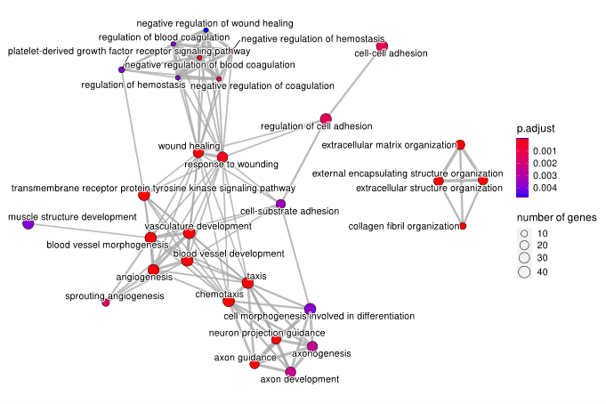
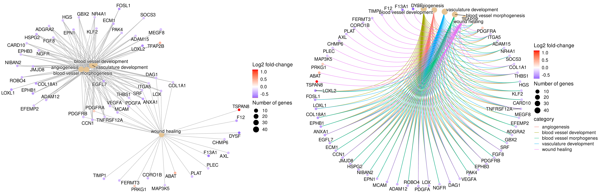

# H3F3A-epigenomics

Project on investigating the role of H3F3A in Alveolar Rhabdomyosarcoma.

## Contents:
### 1. H3F3A_RNA-seq
#### a. Merging STAR quantmode read counts
- The read counts from STAR were merged into a single dataframe with `STARo2df`.
#### b. Loading in count data, normalization & QC
- De-duplicating and merging gene names.
- Plotting count distributions for each sample.
- Plotting variance vs mean counts for siH3F3A & siSCR samples to observe overdispersion trend.
- Creating `DESeq2` object.
#### c. DGE Hierarchical Clustering Heatmap & PCA
- Plotting of PCA to show relationships between samples of a specific condition and detect possible outlier samples.
- Hierarchical Clustering Heat-map from correlation values as a complimentary way to show the relationships between samples in the same condition and across conditions.
#### d. Model fitting and hypothesis testing
- Differential expression testing after defining contrast and Log2FoldChange shrinking.
- Summarize results and preview

        out of 28308 with nonzero total read count
        adjusted p-value < 0.05
        LFC > 0 (up)       : 54, 0.19%
        LFC < 0 (down)     : 473, 1.7%
        outliers [1]       : 0, 0%
        low counts [2]     : 17592, 62%
        (mean count < 129)

- Setting thresholds for Log2FoldChange and adjusted p-value to filter results for significant differentially expressed genes.
#### e. Visualization of DEGs
- Differentially expressed genes bar graph.

- Differentially expressed genes Volcano plot.

- Heatmap of Differentially expressed genes.

#### f. Enrichment analysis of significant DEGs
- Mapping HGNC gene symbols to Entrez IDs, filtering genes based on Log2 Fold-change, and sorting genes in descending order.
- `enrichGO` Biological Processes BP (top 10).

- `enrichGO` Molecular Function MF (top 10).

- `enrichGO` Cellular Component CC (top 10).

- `gseGO` Gene Set Enrichment Analysis (GSEA) for Biological Processes BP (top 10).

- `emapplot` Enrichment map for Biological Processes BP.

- `cnetplot` Gene concept network of selected Biological Processes BP of interest.

### 2. H3F3A_ChIP-seq
- This R-markdown contains the analysis code for functional enrichment of the genes found by ChIP-seq of H3F3A with sequencing reads aligned with Bowtie2 and peak calling with Macs2. The peaks used as inputs are the from the `.narrowPeak` file from Macs2.

### 3. ChIP-seq_overlap_RNA-seq
- This R-markdown contains the analysis code for intersecting the significantly differentially expressed genes from H3F3A knockdown RNA-seq and H3F3A ChIP-seq to identify the direct targets of H3F3A.

### 4. TCGA_analysis
- This R-markdown contains the code for querying RNA-seq data from National Cancer Institute (NCI) Genomic Data Commons (GDC), parsing the TPM normalized count data and plotting the correlation between H3F3A and MCAM & EHMT2.

### 5. [/data](./data)
This folder contains the data used for the analysis.

### 6. [/figures](./figures)
This folder contains the figures exported at various steps of the analysis.

## The main rules to follow are:
- All R scripts should be within `/src` and functions should be imported from there so as to not clutter code.
- No data should be committed to git and file paths for data needed to be imported into R should be included in the `config.yaml` file. If file paths contain sensitive information, they can be added to gitignore.
- All analysis code should be in R markdown format as a `.rmd` file. Comments regarding analysis can be written as plain text in the R markdown file.
- renv.lock files can be committed to git for package version tracking and restoring a new renv on another system.

## Dependencies:

- [ChIPseeker](https://bioconductor.org/packages/release/bioc/html/ChIPseeker.html) 1.32.0

- [clusterProfiler](https://bioconductor.org/packages/release/bioc/html/clusterProfiler.html) 4.4.1

- [GenomicFeatures](https://bioconductor.org/packages/release/bioc/html/GenomicFeatures.html) 1.48.0

- [TxDb.Hsapiens.UCSC.hg38.knownGene](https://bioconductor.org/packages/release/data/annotation/html/TxDb.Hsapiens.UCSC.hg38.knownGene.html) 3.15.0

- [org.Hs.eg.db](https://bioconductor.org/packages/release/data/annotation/html/org.Hs.eg.db.html) 3.15.0

- [DOSE](https://bioconductor.org/packages/release/bioc/html/DOSE.html) 3.22.0

- [ReactomePA](https://bioconductor.org/packages/release/bioc/html/ReactomePA.html) 1.40.0

- `ggupset` upsetplot requires this.

- `ggimage` vennpie combined requires this.

- `libcurl4-openssl-dev`

- `libssl-dev`

- `libmagick++-dev`

 

## TODO:

- [ ] Update R packages in REAMDE.
- [ ] Update lib-xxx dependencies in REAMDE.
